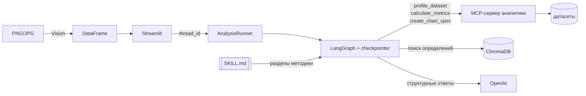
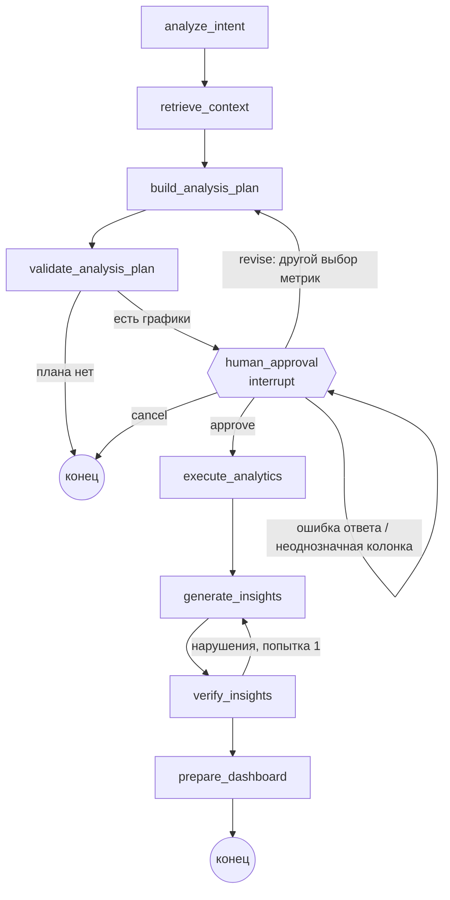
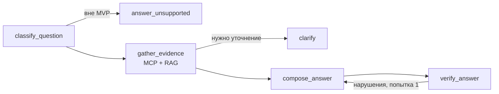

# Архитектура DataStory AI

DataStory AI превращает подтверждённую таблицу (XLSX/CSV) в интерактивный дашборд с выводами. Главный принцип: **числа считает код, а не языковая модель**. LLM планирует анализ и пишет текст, но каждое число в тексте обязано совпадать с результатом MCP-инструмента `calculate_metrics`, а каждое утверждение — быть проверяемым.

## Компоненты

| Компонент | Модули | Что делает |
|---|---|---|
| Интерфейс | `app.py`, `datastory/ui/` | Streamlit: загрузка, профиль, подтверждение структуры, план, дашборд |
| Профилирование | `datastory/profiler/`, `file_processing/`, `storage/` | `DatasetProfile`, типы колонок, качество, персональные данные, рабочее хранилище |
| Vision | `file_processing/image_loader.py`, `ui/views/image_table.py` | PNG/JPG с таблицей → GPT-4o-mini Vision → `DataFrame` → тот же профайлер |
| RAG | `datastory/rag/` | ChromaDB: определения показателей из PDF и описания колонок, с источниками |
| MCP-сервер аналитики | `datastory/mcp_server/server.py`, `analytics/` | `profile_dataset`, `calculate_metrics`, `create_chart_spec` (Pandas, без LLM) |
| MCP-клиент | `datastory/mcp_client/` | stdio-подключение с жизненным циклом и таймаутами |
| LLM | `datastory/llm/client.py` | OpenAI через `langchain-openai`, ответы только по Pydantic-схеме |
| Workflow | `datastory/workflow/` | LangGraph: узлы, условные переходы, interrupt, runner |
| Чат | `datastory/chat/` | вопросы по готовому дашборду: специализированный маршрут LangGraph (MCP + RAG + проверка) |
| Выводы | `datastory/insights/` | числовые доказательства (`facts`), генерация (`generator`), проверка (`verifier`) |
| Методика | `.claude/skills/datastory-analysis/SKILL.md`, `datastory/skills.py`, `workflow/methodology.py` | Skill с правилами анализа, который загружается LLM-этапами |
| Оценка | `datastory/evaluation/` | структурные проверки результата |

## Пользовательский сценарий (Streamlit)

Три экрана на одной странице; экран определяется состоянием сессии анализа (`st.session_state["analysis_session"]` хранит `thread_id`, датасет, цель), поэтому перерисовки ничего не пересчитывают.

| Экран | Модуль | Что происходит |
|---|---|---|
| 1. Загрузка данных | `ui/views/analysis.py`, `image_table.py` | CSV/XLSX/PNG/JPG → `DataFrame` → предпросмотр, строки, колонки, период данных, сводка качества (`report/builder.py`); поле цели и кнопки «Составить план анализа» / «Предложить анализ автоматически» (цель `AUTO_GOAL`). Кнопка сохраняет датасет, индексирует профиль и PDF, запускает граф до `human_approval` |
| 2. План анализа | `ui/views/analysis_run.py` | Карточки `AnalysisStep` (название, зачем, показатель, группировка, визуализация), «Включить» у каждой, «Построить аналитику» = `resume` с выбранными шагами. Включение шага без определения в документации подтверждает формулу; неоднозначную колонку выбирают на карточке |
| 3. Дашборд | `ui/views/analysis_run.py` | KPI, графики с выводом и «На основе: …», «Ключевые выводы», «Использованный контекст» (`AnalysisResult.context_sources`), предупреждение об автоматических выводах, «Скачать отчёт», чат |

`AnalysisStep` (`workflow/models.py`) — шаг плана с полем `rationale` (зачем); прежнее имя `PlannedChart` сохранено как псевдоним. Для автоматического анализа `analyze_intent` не сужает набор анализов и не обращается к LLM.

**Отчёт** (`report/builder.py`) строится только из готовых `AnalysisResult` и `DatasetProfile`, без новых расчётов и вызовов LLM: описание набора (файл, строки, колонки, период, качество), KPI, анализы (зачем, показатель, группировка, данные графика, вывод, числовые доказательства, «На основе», ограничение), ключевые выводы, использованные источники базы знаний, примечания. Ключевые выводы — самые важные из уже проверенных выводов: сначала предупреждения, затем честные оговорки о неустановленных причинах и отсутствующей документации. Событие из документации предлагается модели только для графика с существенным падением.

## Workflow

Граф собирается в `datastory/workflow/graph.py`, девять узлов:

| Узел | Работа |
|---|---|
| `analyze_intent` | MCP `profile_dataset`: колонки и доступные метрики; какие из четырёх анализов возможны и почему нет; при наличии запроса LLM (`IntentDraft`) выбирает анализы |
| `retrieve_context` | RAG: определение каждого показателя и сопроводительный контекст (события, ограничения) с источниками |
| `build_analysis_plan` | LLM (`PlanDraft`) предлагает план; без LLM — правила. **Загружает Skill (этап `plan`)** |
| `validate_analysis_plan` | детерминированная проверка плана (см. ниже) |
| `human_approval` | LangGraph `interrupt`: пользователь подтверждает график и показатели, уточняет колонки |
| `execute_analytics` | MCP `calculate_metrics` и `create_chart_spec` для каждого утверждённого графика |
| `generate_insights` | `Insight` на каждый график: LLM (`InsightDraft`) или правила. **Загружает Skill (этап `insights`)** |
| `verify_insights` | проверка достоверности; одна повторная генерация с замечаниями, затем расчётный текст |
| `prepare_dashboard` | `DashboardSpec` и `AnalysisResult` |

### Модели (Pydantic)

`AnalysisPlan`, `MetricDefinition`, `PlannedChart` — `workflow/models.py`; `Insight`, `NumericEvidence`, `ChartSpec` — `models.py`; `DashboardSpec`, `AnalysisResult` — `workflow/models.py`. `MetricDefinition` в плане — то, что видит пользователь (формула, источник определения, подтверждена ли формула); не путать с одноимённым классом-правилом расчёта в `analytics/metrics.py`. Для MVP план содержит не более четырёх графиков: динамика количества операций, объёма, успешности и распределение по каналам.

### Условная логика

- **Нет нужной колонки** — показатель исключается из плана с причиной («нет колонки «Amount_KZT»»). Решает `evaluate_candidates`, проверяет `validate_analysis_plan`: LLM не может вернуть исключённый показатель или несуществующую колонку.
- **Нет бизнес-определения** — показатель помечается «документация отсутствует». Строится только если пользователь явно подтвердил формулу расчёта; в выводе появляется ограничение интерпретации.
- **Неоднозначная колонка** (несколько подходящих дат или категорий) — `ColumnMapping.status = ambiguous`, пользователю задаётся вопрос. Колонка принимается без вопроса, только если единственная либо модель и RAG указали одну и ту же.
- **План отклонён** — `revise` с новым выбором метрик возвращает граф в `build_analysis_plan`; число пересмотров ограничено.

### Human-in-the-loop и Streamlit

`human_approval` вызывает `interrupt()`; состояние хранится в `MemorySaver` под `thread_id`. Каждый запуск анализа получает новый `thread_id`, интерфейс хранит в `st.session_state` только его. `AnalysisRunner` (кэш `st.cache_resource`) держит граф и чекпоинтер, поэтому перерисовка скрипта вызывает `snapshot()` — чтение сохранённого состояния без повторных вызовов MCP и LLM, а ответ пользователя — `resume()` — продолжает граф с точки остановки. Сессии хранятся в памяти процесса (до 20 последних); сериализуемые типы состояния перечислены явно.

## Изображения с таблицами (Vision)

Все форматы приводятся к одному `DataFrame`, а затем к `DatasetProfile`: отдельной аналитики для изображений нет.

1. `prepare_image` проверяет файл (PNG/JPEG, размер, не повреждён), учитывает EXIF-поворот и уменьшает длинную сторону до 2048 px.
2. `recognize_table` отправляет изображение в `gpt-4o-mini` (`VISION_MODEL`) и получает структурный `TableExtraction`: заголовки, строки как текст «как напечатано», нечитаемые ячейки. Числа и даты модель не интерпретирует.
3. `frame_from_extraction` строит `DataFrame`: выравнивает строки неверной длины, переименовывает пустые и повторяющиеся заголовки, всё это — с предупреждениями. Нет таблицы, нет заголовков или строк — понятная ошибка (`TableNotFoundError`, `NoDataError`), нет ключа — `VisionUnavailableError`.
4. Интерфейс показывает изображение и редактируемые заголовки и ячейки, пользователь исправляет ошибки и подтверждает таблицу. Результат распознавания хранится в `st.session_state` по хешу изображения: перерисовки не повторяют запрос к модели. Правка после подтверждения сбрасывает подтверждение.
5. Подтверждённая таблица идёт в общий `build_profile` (типы, качество, ПДн), затем в хранилище и LangGraph — как XLSX и CSV.

## Чат по дашборду

Чат доступен на странице готового дашборда (`ui/views/chat_panel.py`); история хранится в `st.session_state["chat::<thread_id>"]`, у каждой сессии анализа своя. Маршрут — отдельный граф LangGraph (`chat/graph.py`) на тех же `WorkflowDeps`:

Шесть поддерживаемых типов вопросов и откуда берутся данные:

| Вопрос | Источник |
|---|---|
| Что означает показатель? | RAG: определение с источником + формула из определений MCP; нет в документации — так и сказано |
| Как изменился показатель? | результат MCP: с дашборда, а если такого расчёта нет — новый вызов `calculate_metrics` |
| Какой месяц максимальный? | те же результаты, факты `max`/`min` |
| Какой канал лидирует по операциям? | `calculate_metrics` по категориальной колонке (готовый результат или новый вызов) |
| Какие изменения заслуживают внимания? | факты рядов: существенное падение или рост (порог в п.п. или доля от максимума) |
| Какие события в документации? | RAG: предложения, называющие событие и время; цитаты дословные |

Дополнительно «почему изменился показатель» (`cause_question`): причина по данным не определяется, ответ называет факт изменения и событие из документа как совпадающее по времени.

**Тип вопроса** определяет LLM (`QuestionPlan`, показатель проверяется по списку доступных), без LLM — правила по ключевым словам (`chat/classify.py`). Тип — один из фиксированного набора: код из вопроса не генерируется и не исполняется (тест проверяет отсутствие `eval`/`exec`/`subprocess`). Вопросы вне возможностей (прогнозы, произвольные вычисления, изменение данных, фильтры по месяцу) получают пояснение с перечнем поддерживаемых вопросов. Если показатель не назван, ответ строится по всем показателям дашборда, а при их отсутствии чат просит уточнить.

**Числа** — только из результатов MCP, разности и доли считает Python (`insights/facts.py`); id доказательств получают префикс показателя. Ответ LLM (`ChatAnswerDraft`) проходит тот же `verifier`, что и выводы дашборда (числа, причины, рост/снижение, периоды) плюс дословность цитат; дословные предложения документа не считаются «числами вывода». После нарушения — одна повторная попытка с замечаниями, затем ответ по правилам. Ограничения (причина неизвестна, нет определения, событие не доказывает причину) добавляет код. Системный промпт этапа — разделы Skill для этапа `chat` (шаги 3, 5–8 и правила анализа).

## Достоверность выводов

LLM получает не таблицу, а сводку датасета без персональных данных и **числовые доказательства** — значения из `calculate_metrics` и простые сравнения, посчитанные Python (`insights/facts.py`): значения периодов, разности, доли. LLM возвращает текст и `id` доказательств; сами доказательства, источник данных, источник контекста и обязательные ограничения добавляет код (`insights/generator.py`). Итоговый `Insight`: название, краткий вывод, числовые доказательства, источник данных, источник бизнес-контекста (если использован), ограничение интерпретации.

`insights/verifier.py` отклоняет вывод, если: число не совпадает ни с одним доказательством (с допуском на указанное округление); утверждается причина без оговорки «не доказано»; есть «рост»/«снижение» без сравнения или с противоположным знаком; упомянут месяц, которого нет в данных графика; цитата из документа не найдена дословно в источнике. Отклонённый вывод перегенерируется с перечнем нарушений, затем заменяется расчётным текстом (`fallback`). Причина изменения всегда помечена как неустановленная, если данные её не содержат.

## Skill `datastory-analysis`

`.claude/skills/datastory-analysis/SKILL.md` — единственный источник методики интеллектуального анализа: YAML frontmatter (`name`, `description` с условиями применения), последовательность из восьми шагов (структура → показатели и измерения → бизнес-определения → визуализация → расчёты через MCP → изменения → выводы на числах → проверка достоверности), правила выбора визуализации (V1–V6) и правила анализа (A1–A7).

**Как Skill используется.** `datastory/skills.py` читает файл при каждом обращении. `workflow/methodology.py` задаёт, какие разделы получает этап: `build_analysis_plan` — шаги 1–4, правила визуализации и правила анализа; `generate_insights` — шаги 5–8 и правила анализа; ответы чата (`compose_answer`) — шаги 3, 5–8 и правила анализа. Промпт этапа = короткая инструкция формата ответа + разделы Skill; текста правил в Python-коде нет (это проверяет тест). Разбор запроса (`analyze_intent`) методику не получает. В `AnalysisResult.methodology` записано, на каких этапах Skill попал в промпт. Если Skill не найден или повреждён, LLM на этапе не вызывается, этап выполняется по правилам с предупреждением.

**Как правила проверяются.** Таблица `ENFORCEMENT` в `workflow/methodology.py` связывает каждое правило Skill с местом проверки в коде: V1–V4 — `catalog.fit_chart_type`, V6 — `AnalysisPlan`, A1/A3/A4/A6/A7 — `verifier`, A2 — `planning.apply_decision`, A5 — `insights/facts.py` и MCP. Тест требует, чтобы идентификаторы в SKILL.md и в таблице совпадали, а каждое нарушение `verifier` ссылалось на правило Skill (`… (правило методики A3)`), поэтому методика и код не расходятся.

## Трассировка (LangSmith)

`datastory/observability.py`. Конфигурация — только переменные окружения (`LANGSMITH_TRACING`, `LANGSMITH_API_KEY`, `LANGSMITH_PROJECT`, `LANGSMITH_ENDPOINT`, `LANGSMITH_WORKSPACE_ID`); `get_settings()` переносит их в окружение LangSmith. Трассировка включается только при флаге **и** ключе; без ключа она принудительно выключается, в лог и на главную страницу выводится причина. Итог — `TracingStatus`.

| Что | Как трассируется |
|---|---|
| LangGraph (workflow и чат) | автоматически: корневой run с именем действия (`datastory.analysis.plan`, `.approve`, `datastory.chat.ask`), узлы графа — дочерние span-ы; `thread_id` и `dataset_id` в метаданных связывают трассы сессии |
| LLM | `ChatOpenAI` создаёт LLM-run; `_invoke` задаёт имя `llm.<Схема>`, теги и метаданные (схема, модель) |
| Генерация плана, вывода, проверка | `analysis_plan.generate`, `insight.generate`, `insight.verify` с входами и выходами (планировщик, шаги, нарушения) |
| RAG | `@traced` на `search_business_context`, `search_dataset_metadata`, `resolve_column`; поиск — run типа retriever (фрагменты, оценки, источники); `openai.embeddings` без текстов |
| MCP | `AnalyticsMcpClient._call` — span типа tool `mcp.<инструмент>`: название, длительность (`mcp.duration_ms`), статус (`mcp.status`), при ошибке `mcp.error_type` и error |
| Vision | span `vision.recognize_table` со сводкой; вызов модели с изображением исключён из трассировки |

Строки таблицы и изображения в трассы не попадают. Когда трассировка выключена, span-ы не отправляют ничего и сеть не нужна. Пауза `human_approval` отображается в LangSmith как `GraphInterrupt` — это штатная остановка графа.

## Универсальные показатели и план по запросу

Для набора без колонок платёжной системы показатели определяет `analytics/metrics.py` и считает тот же инструмент `calculate_metrics`: `sum:<колонка>` (сумма), `ratio:<числитель>/<знаменатель>` (сумма к сумме, например средний чек) и `rate:<счётчик>/<счётчик>` (доля в процентах, например доля отмен). Платёжные показатели и наборы с платёжными колонками не затронуты.

**План по запросу** (`workflow/custom_plan.py`). Если задан запрос (не автоанализ), `retrieve_context` ищет в RAG фрагменты по запросу (Top-3), а `build_analysis_plan` просит LLM вернуть шаги `StepDraft`: показатель (только из списка доступных), группировку (до двух колонок, дата первой), фильтры, тип графика, `requested_term` — фразу запроса, названную показателем. `validate_analysis_plan` проверяет шаги по данным: показатель существует; колонки и значения фильтров есть в данных (регистр приводится к написанию в данных, период должен лежать в диапазоне дат); тип графика по правилам V1–V4; определение показателя ищется в документах (для отношения фрагмент обязан назвать обе колонки). Слова о динамике добавляют ось времени, неопределённая группировка («по группам») превращается в вопрос пользователю. `term_conflict` не даёт подменить показатель, описанный в документах, но не рассчитываемый по данным (Return Rate ≠ доля отмен). Всё, чего нет (EBITDA, прогноз), попадает в `plan.unsupported` и не строится; пустой ответ модели повторяется один раз и, если остаётся пустым, объявляется явно. Без LLM работает каталог анализов.

## Evaluation pipeline

`datastory/evaluation/`: `golden.py` (модели, загрузка), `golden_builder.py` (30 случаев и эталонные числа на чистом Python по строкам генератора `scripts/generate_sales_demo.py`), `scoring.py` (метрики), `runner.py` (запуск), `report.py` (EVALS.md), `__main__.py` (команда). Демо-данные: `sales_2026.xlsx` (288 строк, регион × канал × категория × месяц) и три PDF в `data/demo/sales_docs/` (определения показателей, каналы и регионы, календарь событий).

Каждый случай проходит три независимые проверки: **retrieval** (`KnowledgeBase.search_business_context`, Top-3, нужный документ и раздел); **план** (настоящий workflow с LLM и RAG до подтверждения: показатель, колонки, группировка; поведение — ответ, отказ или уточнение); **числа** (MCP по эталонному плану против Python — правильность расчётов не зависит от LLM, и по плану системы — сквозная проверка, допуск `rel 1e-9`). Собираются задержка (RAG, план, MCP), токены LLM (из `usage_metadata` ответов OpenAI через `llm/usage.py`) и токены эмбеддингов, доля отклонённых недопустимых запросов. Результаты пишутся в `evaluation/results/latest.json` и копируются в `history/`; `EVALS.md` собирается только из `latest.json` (в нём его sha256), значения не задаются вручную, а метрика без данных показывается как «—» с причиной. Частичный прогон (`--groups`, `--cases`) пишет `partial.json` и `EVALS.md` не трогает. Тест сверяет, что опубликованный `EVALS.md` собран из текущего `latest.json`, а golden cases не менялись после запуска.

Golden cases не являются независимой отложенной выборкой: планировщик дорабатывался на близких запросах (это сказано в EVALS.md).

### Выбор гиперпараметров (`hyperparams.py`)

Параметры генерации структурных ответов заданы настройками `llm_temperature` и `llm_max_output_tokens` (`datastory/config.py`; `get_llm` передаёт их в `OpenAIStructuredLLM`, Vision-клиент остаётся при temperature 0 без лимита). Эксперимент переиспользует `ab_test.observe` и статистику `stats.py`: 10 заранее выбранных случаев (по группам, не по результатам), две конфигурации (temperature 0 и 0.4), 5 повторов, порядок чередуется. «Структура» плана — `structure_signature` (поведение, показатель, группировка, фильтры, тип графика, число шагов); стабильность — доля повторов, совпавших с самым частым вариантом; запрос без пригодного ответа модели (ошибка, переход на правила, обрезание по лимиту токенов) считается отдельной «структурой». `decide()` применяет правило выбора и формирует причины и оговорки из чисел результата; `recompute()` пересчитывает производные значения из сохранённых наблюдений. Ответ, упёршийся в `max_tokens`, превращается клиентом в `LLMError` (`LENGTH_LIMIT_MESSAGE`), и план строится по правилам с предупреждением, а не падает.

### A/B эксперимент (`ab_test.py`, `stats.py`)

Переключатель `PlannerRag(context_hits, only_relevant, validation)` в `WorkflowDeps` управляет только RAG планировщика: сколько фрагментов попадает в промпт (0 — раздела с документами нет вовсе) и обращается ли к базе знаний проверка плана после ответа LLM. Конфигурации: **A** (`context_hits=0`), **B** (`context_hits=5`, без порога релевантности) — проверка плана в обоих одинакова; вспомогательная **A0** отключает RAG полностью. Системный промпт не зависит от конфигурации; `RecordingLLM` записывает промпты каждого вызова, а хеш системного промпта сохраняется в результатах (`identical_system_prompt`). Одна LLM с явно заданными `temperature=0` и `max_tokens`; каждый случай выполняется несколько раз, порядок конфигураций чередуется. Метрики плана считаются по тем же `predict`/`score_plan`, что и в основном evaluation; числа MCP в A/B не пересчитываются. Сравнение B − A: разница долей с бутстрап-интервалом по случаям (повторы усредняются внутри случая, перевыборка — по случаям) и точный тест знаков по расходящимся парам; `conclude()` выводит «RAG лучше» только при `confirmed_better` (интервал выше нуля) и всегда добавляет оговорку о потолке (если A уже почти 100%) и малой статистической силе. Результат — `evaluation/results/ab_test.json`; секция A/B в `EVALS.md` строится из него тем же генератором отчёта (`report.render_ab`), без ручных чисел.

## Обработка ошибок

- MCP недоступен — `McpConnectionError` не подменяется локальными расчётами; сессия получает состояние `failed`, доступен `retry()` с узла, на котором остановились. Отказ инструмента на одном графике (`McpToolError`) пропускает график с предупреждением.
- Изображение без таблицы, нечитаемое или слишком маленькое — понятная ошибка и повтор распознавания; нет ключа OpenAI — пояснение, что загрузить XLSX/CSV.
- MCP недоступен в чате — ответ помечен ошибкой, страница не падает.
- LLM недоступна, вернула невалидный ответ, лимит или сеть — `LLMError`; этап переходит на правила, пользователь видит предупреждение. Без ключа OpenAI приложение работает целиком в детерминированном режиме.
- RAG недоступен — показатели считаются недокументированными, требуется подтверждение формул.
- Некорректный ответ пользователя (пустой выбор, чужая колонка, невалидный JSON) — `human_approval` спрашивает снова с пояснением.

## Тесты

`pytest` идёт без сети и ключа OpenAI. Ключевые наборы: `test_workflow_graph.py` (настоящий MCP-сервер, все ветки графа, checkpoint, сессии, сценарные ответы LLM), `test_insight_verifier.py`, `test_workflow_planning.py`, `test_skill_methodology.py` (Skill загружается этапами, правки SKILL.md меняют промпты, текст методики не продублирован в коде), `test_ui_workflow.py` (Streamlit AppTest: запуск, подтверждение, перерисовки), `test_image_table.py` и `test_ui_image.py` (Vision, правка таблицы, ошибки), `test_chat.py` и `test_ui_chat.py` (шесть типов вопросов на демо-датасете, MCP и RAG, границы MVP, история). Живые тесты Vision и чата на настоящей модели: `RUN_LIVE_TESTS=1 pytest -k live`.
